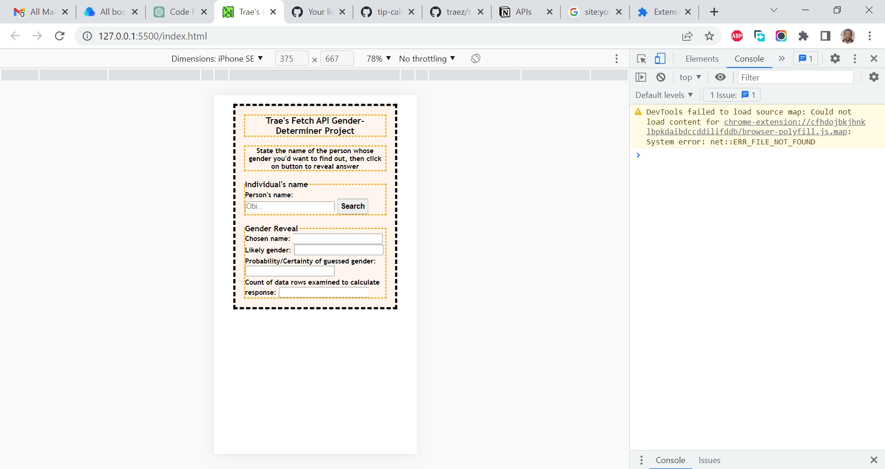

# Section.io - Fetch API Gender-Determiner Beginner Project

This is a beginner project solution to get familiar with the use of Fetch API [This YouTube tutorial was most useful out of several](https://www.youtube.com/watch?v=AVmGmLFcukM). I am trying to improve my coding skills by building realistic projects. 

## Table of contents

- [Overview](#overview)
  - [The challenge](#the-challenge)
  - [Screenshot](#screenshot)
  - [Links](#links)
- [My process](#my-process)
  - [Built with](#built-with)
  - [What I learned](#what-i-learned)
  - [Continued development](#continued-development)
  - [Useful resources](#useful-resources)
- [Author](#author)
- [Acknowledgments](#acknowledgments)

## Overview

### The challenge

Users should be able to:

- Type a name and then get data from the Genderize API to populates fields in the HTML page and confirm likely gender of chosen name.  
- See error response if name input is not acceptable.  

### Screenshot

### Links

- Solution URL: [https://github.com/traez/goated-oop-project-with-javascript](https://github.com/traez/goated-oop-project-with-javascript)
- Live Site URL: [https://traez.github.io/goated-oop-project-with-javascript/](https://traez.github.io/goated-oop-project-with-javascript/)

## My process

### Built with

- Semantic HTML5 markup
- CSS custom properties
- Flexbox
- Mobile-first workflow
- Vanilla JavaScript using Fetch API

### What I learned

Biggest takeaway from building this project was adopting "Separation of concerns" or "Single Responsibility Principle" part of the SOLID code writing principles. The codebase has 4 functions. Old me would have probably left everything in 1 function. Lols.  

### Continued development

Learn and build more API based projects.      

### Useful resources

Stackoverflow  
MDN Web Docs  
w3schools  
YouTube  
Google  
ChatGPT OpenAI chatbot 

## Author

- Website - [Trae Zeeofor](https://github.com/traez)  
- Twitter - [@trae_z](https://twitter.com/trae_z) 

## Acknowledgments

- The many written and video tutorials consumed to get comfortable with Fetch API, promises and Async-await.  
- BigUps to ChatGPT, answered all my code enquiries efficiently and even advised on Javascript code commenting. 
 
